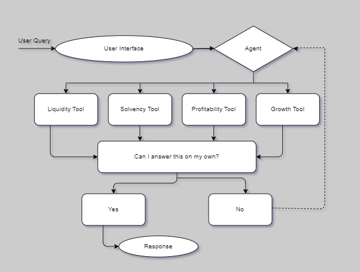

# Financial ChatBot Assistant

## Description
The Financial ChatBot Assistant is an interactive tool designed to simplify and enhance financial analysis. By leveraging LangChain's tool-calling agent and data visualization capabilities, the chatbot provides insightful responses and visualizations for key financial metrics. The system currently supports queries related to three US SEC-listed companies: Microsoft, Apple, and Tesla, offering detailed insights into liquidity, solvency, profitability, and income growth.

## Problem Statement
Understanding and analyzing financial metrics is a complex and time-consuming task, especially for non-experts. Traditional methods of analyzing financial data often lack interactivity and require advanced technical skills to generate insights and visualizations. This project addresses these challenges by combining the capabilities of Large Language Models (LLMs) with automated tool selection and visualization, creating a user-friendly platform for financial analysis.

## Features
- **Interactive ChatBot**: Query financial metrics like liquidity ratios, solvency ratios, and profitability metrics.
- **Financial Ratio Plots**: Generate visual representations of financial data, including Liquidity Ratios, Solvency Ratios, Profitability Ratios, and Income Growth.
- **Dynamic Tool Selection**: LangChain's tool-calling agent selects and sequences tools dynamically to generate accurate responses.
- **Data Visualization**: Seamlessly integrate financial metrics with visually appealing graphs.

   


*Langchain's tool calling agent*

## Installation Guide
1. Create a Conda Environment: Start by creating a new Conda environment with Python 3.12:

```bash
conda create -p venv python=3.12
conda activate venv/
```
2. Install Dependencies: Install the required dependencies using pip:

```bash
pip install -r requirements.txt
```
3. Obtain API Keys:

OpenAI Key: Sign up at OpenAI and obtain your API key for GPT model access.
LangSmith Key: Similarly, obtain your LangSmith API key.

4. Set Up Environment Variables: Create a .env file in your project root directory and add the following:

```bash
OPENAI_API_KEY=your_openai_api_key
LANGSMITH_API_KEY=your_langsmith_api_key
```

## Usage
Run the script:

```bash
python app.py
```

This will start a Gradio interface where you can interact with the Financial ChatBot Assistant.
## Application flow
The agent in our pipeline is equipped with a variety of tools to respond to user queries. The Large Language Model (LLM) acts as the "brain" of the agent, directing its decision-making process. When a user submits a question, the LLM helps the agent choose the most suitable tool or combination of tools to generate an answer. If multiple tools are needed, the agent will determine the appropriate sequence for using them.



*Agentic flow*

## Components
### FinancialChatBotApp Class
The main class responsible for building and launching the Gradio application.

#### Methods
- `__init__`: Initializes the application with a LangChainAgent instance.
- `create_header`: Creates and returns the header markdown for the application.
- `create_chatbot_section`: Creates and returns the chatbot section with input, button, and output components.
- `create_plot_section`: Creates and returns the plot section with dropdowns and button components.
- `build_ui`: Builds the complete Gradio UI by combining different sections.
- `launch`: Launches the Gradio application.

### LangChainAgent Class
Handles the logic for generating responses to user queries related to financial metrics.

### FinancialCalculator Class
Extracts financial metrics and calculates ratios.

### DataLoader Class
Loads the dataset and reads it as a dataframe.

### generate_plot Function
Generates and returns a plot based on the selected plot type and company name.

## Demo
You can check out the live demo here:

[Financial Assistant Demo](https://huggingface.co/spaces/Safni/Financial_assistant)

## Contributions
Contributions are welcome! Please fork the repository and submit pull requests.

